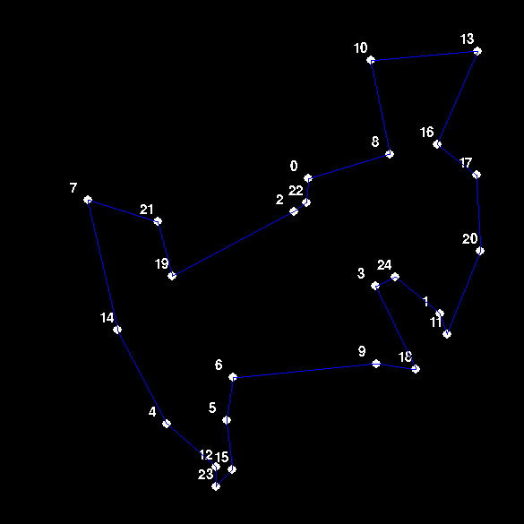
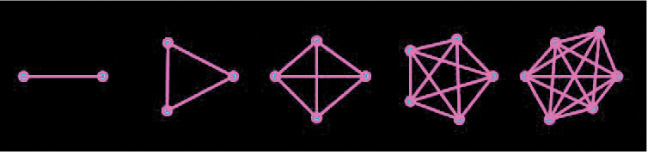

# Travelling-Salesman-Problem-with-Genetic-Algorithm
The Travelling Salesman Problem(TSP) solved using Genetic Algorithms.  
A sample output with 25 destinations and a population of 5000 per generation :

## Table of Contents
1. [General Info](#general-info)
2. [Installations](#installations)

## General Info
### What is the TSP?
The Travelling Salesman Problem (TSP) is the challenge of finding the shortest yet most efficient route for a person to take given a list of specific destinations. It's a very common problem in the fields of Computer Science and Operations Research. TSP belongs to the class of combinatorial optimization problems known as NP-complete, which essentially means that it has no “quick” solution and the complexity of calculating the best route will increase when you add more destinations to the problem. 

### What are Genetic Algorithms?
A genetic algorithm is an algorithm that randomly generates a number of attempted solutions for a problem. This set of attempted solutions is called the "**population**".
It then tries to see how well these solutions solve the problem, using a given **fitness function**. The attempted solutions with the *best fitness value* are used to generate a new population. This can be done by making small changes to the attempted solutions (**mutation**) and/or by combining existing attempted solutions (**crossover**).
The idea is that, over time, an attempted solution emerges that has a high enough fitness value to solve the problem.

### Why the use of GAs to solve TSP?
It turns out, above a certain number of destinations, the computational complexity gets too much even for today’s supercomputers. When there are two or three destinations, there’s only one possible route. Add a fourth destination, and it could be visited between any of the previous three, so multiply the previous number of routes by 3. 

It turns out the possible routes for n destinations is <b> (n - 1)! / 2 </b>.  So between 10 cities there are 181,440 possible routes. Between 20 cities, there are 60,822,550,204,416,000 routes.
Using GAs, we'll only be looking at the "best routes" in each generation and creating offsprings based on these routes via crossover. After some time, this will converge to a single best route which will be, in other words, the shortest path between all the destinations. 

## Installations
The animation is built using PyGame (1.9.6).  
Python version : 3.5.2

